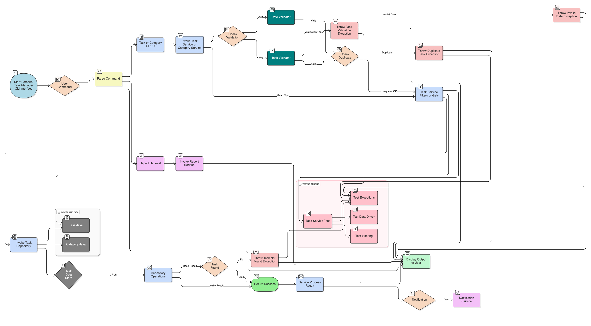

# Personal Task Manager (CLI Version)

A **Command-Line Java Application** designed to help users organize, manage, and track their personal tasks effectively.  
Built using **Core Java**, **OOP principles**, and **TestNG** for comprehensive unit testing.  
This project demonstrates a clean architecture with layered design and custom exception handling.

---

# Project Overview

The **Personal Task Manager (CLI)** is a backend system that allows you to:
- Create, update, and delete tasks  
- Assign categories and priorities  
- Set due dates and get overdue task reports  
- Filter and sort tasks by category, status, and priority  
- Generate simple reports and reminders via CLI  

---
# Technology Stack

- **Java 11**: Core programming language
- **Maven**: Build and dependency management
- **TestNG**: Testing framework
- **Collections Framework**: ConcurrentHashMap, ArrayList for data storage
- **Java Time API**: LocalDateTime for timestamp management
- **Enums**: Type-safe constants for various categories

#  Project Structure

```
personal-task-manager/
├── src/
│   ├── main/java/
│   │   └── com/taskmanager/
│   │       ├── model/
│   │       │   ├── Task.java
│   │       │   ├── Category.java
│   │       │   └── Priority.java
│   │       ├── exception/
│   │       │   ├── TaskNotFoundException.java
│   │       │   ├── InvalidDateException.java
│   │       │   ├── DuplicateTaskException.java
│   │       │   └── TaskValidationException.java
│   │       ├── service/
│   │       │   ├── TaskService.java
│   │       │   ├── CategoryService.java
│   │       │   ├── NotificationService.java
│   │       │   └── ReportService.java
│   │       ├── repository/
│   │       │   ├── TaskRepository.java
│   │       │   └── CategoryRepository.java
│   │       ├── util/
│   │       │   ├── DateValidator.java
│   │       │   └── TaskValidator.java
│   │       └── App.java
│   └── test/java/
│       └── com/taskmanager/
│           ├── service/
│           │   ├── TaskServiceTest.java
│           │   ├── CategoryServiceTest.java
│           │   └── ReportServiceTest.java
│           ├── repository/
│           │   └── TaskRepositoryTest.java
│           └── util/
│               └── DateValidatorTest.java
│
├── pom.xml
└── README.md
```

---

## Core Components

**Model Layer** 
Defines data models:
- **Task.java** — title, description, due date, priority, status, timestamps.  
- **Category.java** — category grouping.  
- **Priority.java** — Enum with `HIGH`, `MEDIUM`, `LOW` values.  

**Repository Layer** 
- **TaskRepository.java** — stores tasks using a `ConcurrentHashMap`.  
- **CategoryRepository.java** — manages in-memory categories.  

**Service Layer** 
Implements business logic:
- **TaskService.java** — CRUD, filtering, sorting.  
- **CategoryService.java** — manages categories.  
- **NotificationService.java** — handles reminders.  
- **ReportService.java** — generates reports and statistics.  

**Utility Layer** 
- **DateValidator.java** — validates date inputs.  
- **TaskValidator.java** — checks rules and duplicates.  

**Exception Layer** 
Custom exceptions:
- **TaskNotFoundException**
- **InvalidDateException**
- **DuplicateTaskException**
- **TaskValidationException**
---

#  OOP & Core Java Concepts

| Concept         |            Example             |
|-----------------|--------------------------------|
| Encapsulation   | Getters/setters in `Task.java` |
| Abstraction     | Service interfaces             |
| Inheritance     | Exception hierarchy            |
| Polymorphism    | Method overriding              |
| Collections     | HashMap, ConcurrentHashMap     |
| Concurrency     | Thread-safe repository         |
| Date/Time API   | LocalDate, LocalDateTime       |

---

**Testing (TestNG)** 

Includes full TestNG suite with:

**Test Areas** 
- CRUD operations  
- Filtering and sorting  
- Exception handling  
- Overdue tasks validation  

**Dependencies** 

```xml
<dependencies>
    <dependency>
        <groupId>org.testng</groupId>
        <artifactId>testng</artifactId>
        <version>7.8.0</version>
        <scope>test</scope>
    </dependency>
</dependencies>
```
---

**How to Run** 

# 1️ Compile:
```bash
mvn clean compile
```

# 2️ Run App:
```bash
mvn exec:java -Dexec.mainClass="com.taskmanager.App"
```

# 3️ Run Tests:
```bash
mvn test
```

**Key Testing Strategies Demonstrated:**

-**Exception Testing**: 
        Verifying that critical operations throw the correct custom exceptions (e.g., DuplicateTaskException, TaskNotFoundException) upon business rule violation using @Test(expectedExceptions = ...).

-**Data-Driven Testing**: Utilizing @DataProvider to test service methods against various sets of input data (e.g., different date formats, all priority levels) for maximum coverage.

-**State-Based Testing**: Asserting the system's state after complex transactions (e.g., verifying getTasksByStatus returns the exact subset of tasks after multiple status updates).

---
# Reports & Logging

- Reports: `target/surefire-reports/`  
- Console: shows validation, exception, and CRUD logs  
---

<h2>🧩 Framework Flowchart</h2>
The diagram below illustrates the overall workflow of Personal Task Manager CLI version with TestNG — from test initialization to report generation.  
<p align="center">
  
</p>

---

**Future Enhancements**

- Database or JSON persistence  
- Task import/export  
- CLI color themes  
- Jenkins CI/CD integration  
- REST API layer for UI  

---

**Author**

**Ruby Fathima**   
